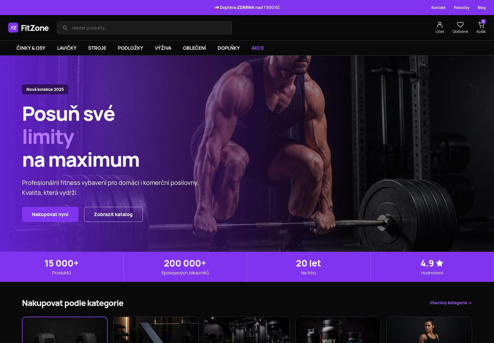
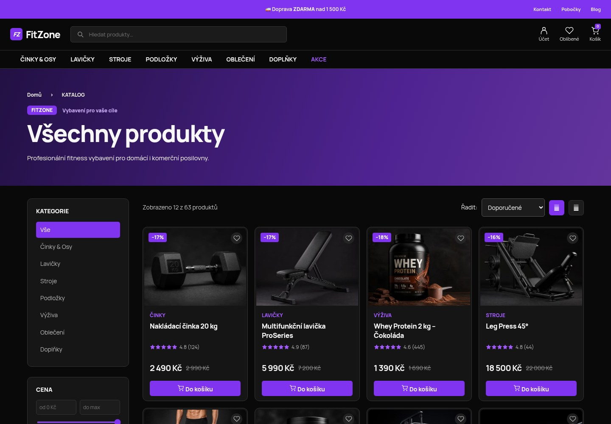
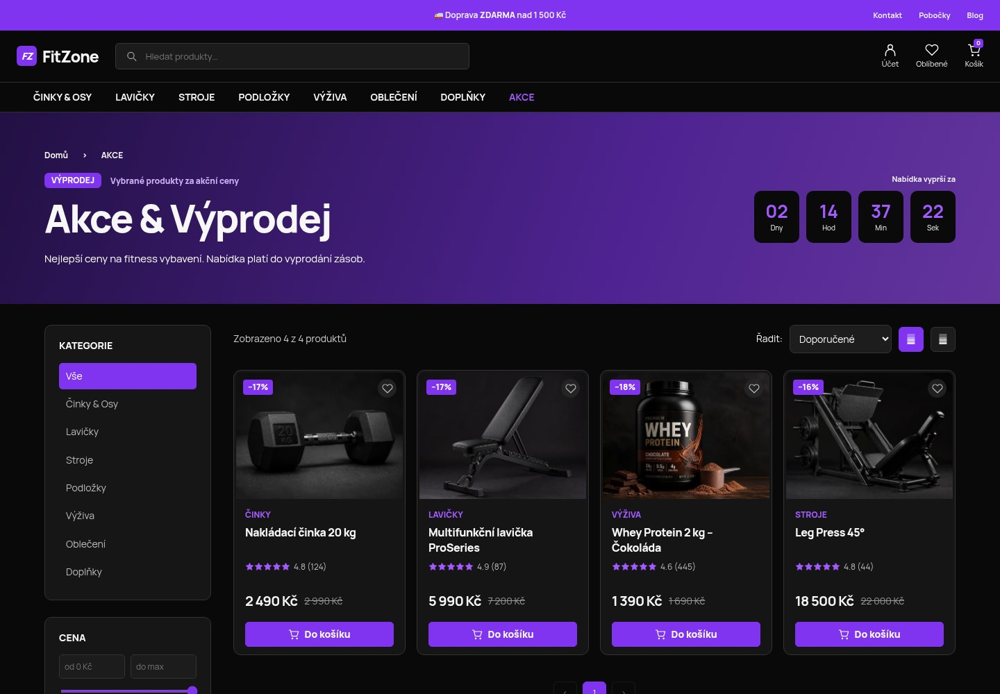
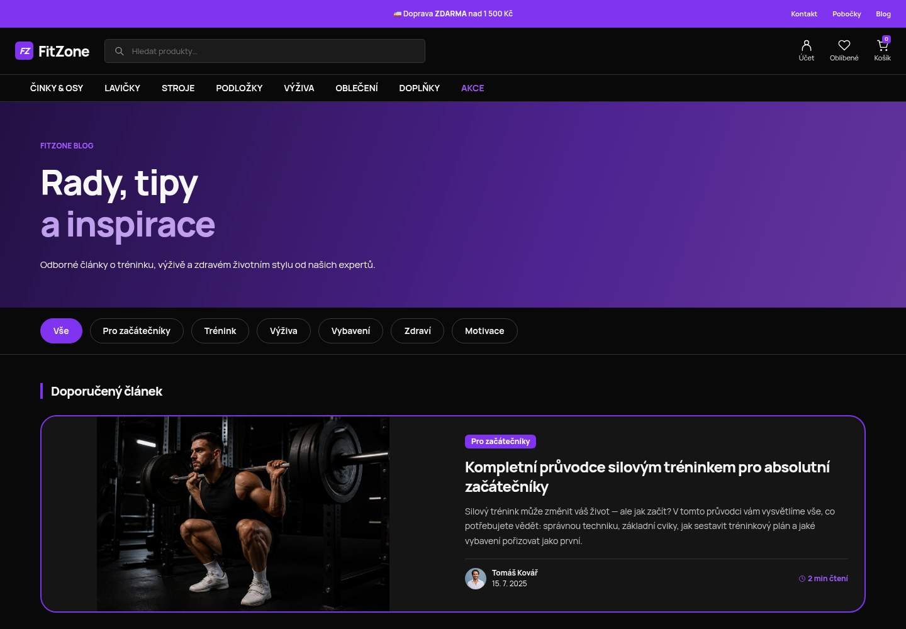

# FitZone

E-shop postavený na WordPressu a WooCommerce s vlastní šablonou `fitzone`.

## Požadavky

- Git
- Nainstalovaný DDEV a spuštěný Docker

Konfigurace v `.ddev/config.yaml` používá PHP 8.4, MariaDB 11.8 a nginx-fpm.
Součástí projektu je WordPress, plugin WooCommerce i šablona; pro spuštění není potřeba instalace přes Composer nebo npm.

## Spuštění projektu

Příkazy spouštějte v terminálu hostitelského počítače, nikoli uvnitř DDEV kontejneru.

```bash
git clone https://github.com/elanger25/fitzone.git
cd fitzone
ddev start
ddev import-db --file=.ddev/fitzone.sql.gz
ddev wp cache flush
ddev launch
```

Pokud už máte projekt stažený, začněte příkazem `ddev start` v jeho kořenové složce.
Import obnoví uložený obsah a nastavení a přepíše stávající databázi tohoto DDEV projektu. Při běžném dalším spuštění stačí `ddev start`, databázi znovu neimportujte.

- Web: https://eshop.ddev.site
- Administrace: https://eshop.ddev.site/wp-admin/

Název DDEV projektu je `eshop`, přestože Git repozitář se jmenuje `fitzone`.
Připojení k databázi pro lokální prostředí zajišťuje `wp-config-ddev.php`.

## Přístup do administrace

Použijte existující účet z obnovené databáze. Pokud neznáte heslo, zobrazte účty a nastavte nové heslo vybranému uživateli:

```bash
ddev wp user list --fields=ID,user_login,roles
ddev wp user update <ID> --prompt=user_pass
```

Nahraďte `<ID>` skutečným ID účtu. Heslo zadáte interaktivně.

## Databázový dump

Soubor `.ddev/fitzone.sql.gz` obsahuje úplný export databáze z 18. 9. 2026, včetně obsahu, nastavení a uživatelských účtů. Jde o skutečná data projektu, nikoli anonymizovaná demonstrační data.
Mediální soubory nejsou součástí SQL exportu; jsou v `wp-content/uploads/` a musí být přeneseny spolu s projektem.

Aktualizace dumpu z hostitelského počítače:

```bash
ddev export-db --file=.ddev/fitzone.sql.gz
```

Obnovení dumpu:

```bash
ddev import-db --file=.ddev/fitzone.sql.gz
```

## Změna lokální domény

Pokud změníte název DDEV projektu, po importu nahraďte původní URL v databázi. Například pro název `fitzone`:

```bash
ddev wp search-replace 'https://eshop.ddev.site' 'https://fitzone.ddev.site' --all-tables-with-prefix --skip-columns=guid
ddev wp cache flush
```

## Běžné příkazy

```bash
ddev start             # Spuštění prostředí
ddev stop              # Zastavení prostředí
ddev describe          # Adresy a informace o prostředí
ddev wp db check       # Kontrola databázových tabulek
```

Vlastní šablona je v `wp-content/themes/fitzone/`, pluginy v `wp-content/plugins/`.

## Představení e-shopu a screenshoty

FitZone je fitness e-shop s vlastní českou šablonou, katalogem WooCommerce,
vyhledáváním a filtrováním produktů, košíkem, akčními nabídkami a blogem.

[Otevřít HTML prezentaci na GitHub Pages](https://elanger25.github.io/fitzone/)
— odkaz bude fungovat po zapnutí Pages podle postupu níže.

[](https://elanger25.github.io/fitzone/)

| Katalog produktů | Akční nabídky |
| --- | --- |
|  |  |



### Zveřejnění přes GitHub Pages

Prezentace je samostatná statická stránka v `docs/index.html` s obrázky a CSS
ve složce `docs/assets/`. Lokálně ji otevřete na https://eshop.ddev.site/docs/
nebo přímo jako soubor `docs/index.html` v prohlížeči.

1. Odešlete nové soubory na GitHub z kořenové složky projektu:

   ```bash
   git add docs README.md
   git commit -m "Add FitZone presentation and screenshots"
   git push origin main
   ```

2. V repozitáři otevřete **Settings → Pages**.
3. V části **Build and deployment** vyberte **Source → Deploy from a branch**.
4. Nastavte větev **main**, složku **/docs** a klikněte na **Save**.
5. Po dokončení nasazení bude prezentace dostupná na https://elanger25.github.io/fitzone/.

Oficiální postup: [Nastavení zdroje GitHub Pages](https://docs.github.com/en/pages/getting-started-with-github-pages/configuring-a-publishing-source-for-your-github-pages-site).

GitHub Pages zobrazuje tuto prezentaci. Samotný WordPress, databázi a nákupní
funkce je potřeba spustit přes DDEV nebo na hostingu s PHP a databází.
HTML prezentaci nelze vložit jako funkční stránku přímo do README; proto zde
najdete screenshoty a odkaz na Pages. Screenshoty zachycují lokální ukázkový
projekt, včetně demonstračních marketingových údajů z návrhu.
